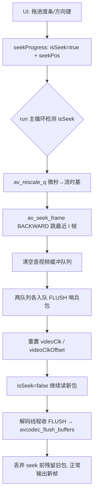

# FFmpeg Seek 详解：API 用法与延迟优化

## 参考博客

- [CSDN：FFmpeg Seek 延迟减小的基本思路](https://blog.csdn.net/weiwei9363/article/details/132307253)
- [百度开发者：基于FFMPEG的跨平台视频播放器简明教程（九）：SEEK策略](https://developer.baidu.com/article/detail.html?id=4792915)

---

## 目录

- [Q1. Seek 的完整流程是什么？](#q1-seek-的完整流程是什么)
- [Q2. seek 相关 API 有哪些？](#q2-seek-相关-api-有哪些)
- [Q3. FFmpeg 提供的四种 seek 选项（AVSEEK_FLAG）有什么区别？](#q3-ffmpeg-提供的四种-seek-选项avseek_flag有什么区别)
- [Q4. seek 前为什么要做时基转换（av_rescale_q）？](#q4-seek-前为什么要做时基转换av_rescale_q)
- [Q5. seek 后为什么要清空缓冲并推入 FLUSH 包？](#q5-seek-后为什么要清空缓冲并推入-flush-包)
- [Q6. seek 延迟的来源有哪些？](#q6-seek-延迟的来源有哪些)
- [Q7. 如何减小 seek 延迟？](#q7-如何减小-seek-延迟)
- [Q8. 连续快速拖拽进度条时 seek 怎么处理？](#q8-连续快速拖拽进度条时-seek-怎么处理)
- [Q9. seek 期间如何保证音视频同步？](#q9-seek-期间如何保证音视频同步)
- [关键源码索引](#关键源码索引)

---

## Q1. Seek 的完整流程是什么？

> **核心结论**：seek 是"**UI 层非阻塞发请求 → 解码主循环执行跳转 → 解码线程响应 FLUSH**"的三段式流程。

**问题递进**：看到拖拽进度条后画面能立刻切换 → 疑问"跳转动作在哪个线程执行？会不会卡 UI？" → 追查代码发现 `seekProgress()` 只置标志位，真正跳转在 `run()` 主循环，从而理解"非阻塞"设计。



---

## Q2. Seek 相关 API 有哪些？

**问题递进**：先遇到 `av_seek_frame` → 又看到 `avformat_seek_file` → 疑问两者区别 → 对比文档后整理出 API 总览。

| API | 作用 | 说明 |
|---|---|---|
| `av_seek_frame(ctx, stream_index, timestamp, flags)` | 基础 seek | 按目标流时基的时间戳定位，配合 flags 控制精确度 |
| `avformat_seek_file(ctx, stream_index, min_ts, ts, max_ts, flags)` | 增强版 seek | 支持 `min_ts`/`max_ts` 区间约束，精准 seek 常用 |
| `av_rescale_q(a, bq, cq)` | 时基换算 | seek 前必须把时间戳转成目标流的 time_base |
| `avcodec_flush_buffers(codecCtx)` | 清解码器内部状态 | seek 后清掉参考帧，防止花屏 |
| `avformat_flush(ctx)` | 清 IO 层缓冲 | 网络流 seek 后建议调用 |
| `av_get_time_base_q()` | 获取 1/1000000 微秒时基 | 与 `av_rescale_q` 配合把微秒转流时基 |

```c
// 项目中的用法：微秒 -> 目标流时基 -> av_seek_frame
AVRational tb = av_get_time_base_q();                                  // 1/1000000
seekPos = av_rescale_q(seekPos, tb, pFormatCtx->streams[idx]->time_base);
int ret = av_seek_frame(pFormatCtx, idx, seekPos, AVSEEK_FLAG_BACKWARD);
```

---

## Q3. FFmpeg 提供的四种 seek 选项（AVSEEK_FLAG）有什么区别？

**问题递进**：看到代码里传 `AVSEEK_FLAG_BACKWARD` → 疑问"为什么不是别的 flag？" → 查头文件发现一共四种，逐个对比。

| 选项 | 值 | 含义 | 适用场景 | 代价 |
|---|---|---|---|---|
| `AVSEEK_FLAG_BACKWARD` | 1 | 向后找**最近关键帧**（≤ 目标 ts） | 最常用，保证从 I 帧开始可正常解码 | 可能停在目标点之前 |
| `AVSEEK_FLAG_BYTE` | 2 | 按**字节偏移**定位，忽略时间戳 | 文件损坏 / 索引丢失时兜底 | 无法保证音视频对齐 |
| `AVSEEK_FLAG_ANY` | 4 | 允许 seek 到**任意帧**（含非关键帧） | 追求精确位置 | 非 I 帧处解码会花屏/丢帧 |
| `AVSEEK_FLAG_FRAME` | 8 | timestamp 解释为**帧序号**而非时间 | 按帧精确跳转（逐帧播放器） | 需知道帧号，通用性差 |

> **高亮**：`AVSEEK_FLAG_BACKWARD` = **默认安全**（永远从关键帧开始解码）；`AVSEEK_FLAG_ANY` = **最快但危险**（位置精确却可能花屏）。这四种 flag 同时适用于 `av_seek_frame` 和 `avformat_seek_file`。

---

## Q4. Seek 前为什么要做时基转换（av_rescale_q）？

**问题递进**：看代码发现 seek 前多了一步 `av_rescale_q` → 疑问"UI 给的微秒不能直接用吗？" → 明白每个流有自己的 time_base。

- UI 层给的是**微秒**（1/1000000），而 `av_seek_frame` 要求 timestamp 使用**目标流的 time_base**（如视频流 1/90000）。
- 不转换直接传微秒，会被当成 1/90000 的数值，导致跳到 90000 倍的位置。

```c
// 换算公式：target = src * bq.num * cq.den / (bq.den * cq.num)
seekPos = av_rescale_q(seekPos, av_get_time_base_q(),  // 源：1/1000000
                       pFormatCtx->streams[idx]->time_base); // 目标：如 1/90000
```

---

## Q5. Seek 后为什么要清空缓冲并推入 FLUSH 包？

**问题递进**：发现 seek 成功后代码没有直接返回，而是"清空队列 + 入队特殊包" → 疑问"这些旧数据不清理会怎样？" → 总结出三个原因。

> **高亮**：**不清缓冲 = 旧数据延迟 + 参考帧错乱花屏**。

| 原因 | 说明 |
|---|---|
| ① 队列残留旧包 | seek 前读入的包会以旧时间戳继续输出，画面"延迟跳到新位置" |
| ② 解码器参考帧错乱 | 帧间预测依赖前向参考帧，seek 后参考帧与新位置不匹配 → 花屏，必须 `avcodec_flush_buffers` |
| ③ 需要同步信号 | 用 `data="FLUSH"` 的哨兵包通知解码线程"清空并重来"，保证音视频线程同步响应 seek |

```c
// 构造哨兵包并推入两个队列（maindecoder.cpp）
AVPacket flushPkt; memset(&flushPkt, 0, sizeof(AVPacket));
flushPkt.data = (uint8_t*)"FLUSH"; flushPkt.size = 5;
audioDecoder->packetEnqueue(&flushPkt);   // 音频队列
videoQueue.enqueue(&flushPkt);            // 视频队列

// 解码线程收到 FLUSH 后清空解码器（videoThread / audioDecoder）
avcodec_flush_buffers(pCodecCtx);
```

---

## Q6. Seek 延迟的来源有哪些？

**问题递进**：实测 seek 有零点几秒延迟 → 疑问"跳转本身很快，慢在哪？" → 发现慢在**跳转后到目标帧的解码过程**。

| 延迟来源 | 说明 |
|---|---|
| ① 关键帧限制 | 只能跳到 I 帧，目标点与最近 I 帧之间的偏差就是"无效播放" |
| ② GOP 长度 | GOP 越长，从 I 帧解码到目标点需解码的帧数越多 |
| ③ 精准 seek 的解码量 | 如 GOP=100，最坏情况需解码 100 帧才到目标帧 |
| ④ 封装格式差异 | MP4 有 moov 索引可精准；FLV 无索引只支持关键帧 seek；TS 需处理 PES 包边界 |
| ⑤ 网络流读取 | 重新定位后 IO 拉流受限；HLS/DASH 分片 seek 还要处理分片边界 |
| ⑥ 线程阻塞 | 主线程直接执行 seek 会造成 UI 卡顿 |

> **高亮：减小 seek 延迟的本质 = 减少 seek 后需要解码的帧数。**

---

## Q7. 如何减小 Seek 延迟？

**问题递进**：Q6 定位到瓶颈后 → 按"减少解码帧数"这一主线，从 API 层到工程层给出四层方法。

### 方法一：精准 Seek（跳后解码到目标帧再输出）
用 `avformat_seek_file` 的 `max_ts` 限制不跳过头，配合解码到 `当前帧 PTS ≥ 目标 PTS` 才显示：

```c
// 只向后不超过目标，避免跳过头再回退
avformat_seek_file(ctx, idx, INT64_MIN, target, target, AVSEEK_FLAG_BACKWARD);
// 解码循环中：输出帧 PTS < 目标 PTS 时丢弃，直到 >= 目标才显示
```

> 精简为三步：**① 粗略定位到关键帧 → ② 解码并丢弃未到达目标时间的帧 → ③ 直到 PTS ≥ 目标才输出**（借助 `av_read_frame` 循环）。

### 方法二：丢弃非参考帧
seek 追赶阶段跳过不需要的帧，减少解码量：

| Flag | 作用 |
|---|---|
| `AV_PKT_FLAG_DISCARD` | 标记该包可丢弃，解码器可跳过 |
| `AV_PKT_FLAG_DISPOSABLE` | 标记该帧解码后立即无用（B 帧等），解码后可立即释放 |

### 方法三：同 GOP 内向后 seek 优化
目标与当前位置**同 GOP 且向后**时，不跳回 GOP 开头的 I 帧，直接持续解码到目标，避免重复解码已解过的帧。

### 方法四：二分查找 + 关键帧索引表（高性能场景）
初始化时预解析所有关键帧（记录 PTS + 文件偏移量），seek 时二分定位最接近目标的关键帧，再从该帧精确解码：

```c
typedef struct { int64_t pts; int64_t pos; } KeyFrameEntry; // 预建索引
// 二分查找 pts 最接近 target 的关键帧 → av_seek_frame 到该偏移
```

### 方法五：工程实践（播放器层）
- **非阻塞 seek**：UI 只置 `isSeek=true` + `seekPos`，不在 UI 线程执行跳转
- **同步等待中断**：解码线程等时钟时发现 `isSeek` 立即中断等待、丢帧快速退出（`maindecoder.cpp:1021-1034`）
- **丢弃残留旧包**：`m_waitingForFlush=true` 期间跳过所有非 FLUSH 包
- **队列限流策略**：本地文件 seek 后清空队列重新填充，避免旧包拖慢
- **异步 seek 架构**（参考实践）：解码线程执行 seek + 互斥锁保护 + 完成回调通知 UI；大文件可用 `hwaccel` 硬件加速缩短解码时间

---

## Q8. 连续快速拖拽进度条时 Seek 怎么处理？

**问题递进**：拖动进度条会连续触发 seek → 疑问"每次都执行跳转会怎样？" → 发现用 `isSeek` 做**防重入**。

- `seekProgress()` 中：`if (!isSeek) { seekPos=pos; isSeek=true; }`，上一个 seek 未完成时**直接忽略新请求**。
- 效果：频繁拖动时只有第一次触发真正跳转，其余被丢弃，避免 seek 风暴（`maindecoder.cpp:616-631`）。

> **高亮**：防重入是"丢中间值保首值"，代价是**丢失最终拖到的位置**；更优做法是"丢中间值保末值"（seek 完成后再补一次），本项目为简单起见采用前者。

---

## Q9. Seek 期间如何保证音视频同步？

**问题递进**：seek 后音视频时钟对不上会花屏/卡顿 → 疑问"时钟基准怎么复位？" → 发现核心是**重置视频时钟对齐偏移**。

- seek 成功后 `videoClk = 0; videoClkOffset = 0;`，让新旧时间线重新对齐（`maindecoder.cpp:1425-1426`）。
- 本地文件 seek 后完全重置 `videoClkOffset`；直播流只计算一次，不做重复重置。
- 同步等待循环中检测到 `isSeek` 立即中断，丢弃当前帧快速回到外层取 FLUSH 包，防止被旧帧的时钟拖住。

```c
videoClk = 0;
videoClkOffset = 0; // seek后重新对齐音视频时间线
isSeek = false;
```

---

## 关键源码索引

> 参考项目：`FFmpegQtPlayer`（梅会东播放器）

| 文件 | 行号 | 内容 |
|---|---|---|
| `mainwindow.cpp` | 421-435 | 左右方向键快进快退 15 秒（秒→微秒） |
| `mainwindow.cpp` | 885-889 | `MainWindow::seekProgress` 秒→微秒转发 |
| `mainwindow.cpp` | 903-917 | `onSliderReleased` 松手触发一次 seek |
| `maindecoder.cpp` | 616-631 | `MainDecoder::seekProgress` 非阻塞 + isSeek 防重入 |
| `maindecoder.cpp` | 1386-1394 | `av_rescale_q` 时基转换 + `av_seek_frame(BACKWARD)` |
| `maindecoder.cpp` | 1407-1424 | 构造 FLUSH 包、清空队列并入队 |
| `maindecoder.cpp` | 1425-1431 | 重置 `videoClk/videoClkOffset`、`isSeek=false` |
| `maindecoder.cpp` | 818-831 | videoThread 收 FLUSH → `avcodec_flush_buffers` + 丢弃旧包 |
| `maindecoder.cpp` | 1021-1034 | 同步等待中断 → 清解码器 + 设 `m_waitingForFlush` |
| `audiodecoder.cpp` | 518-527 | 音频收 FLUSH → `avcodec_flush_buffers` |
