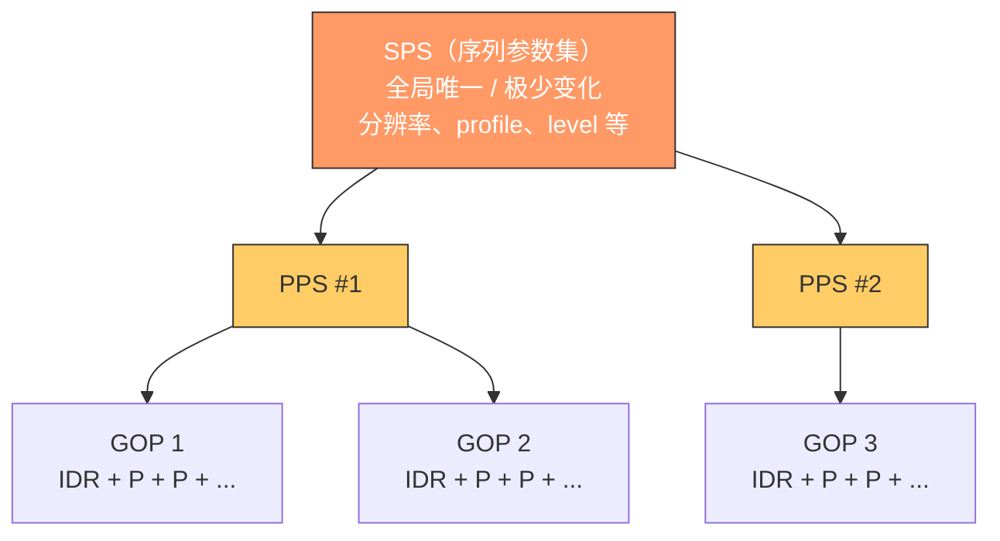
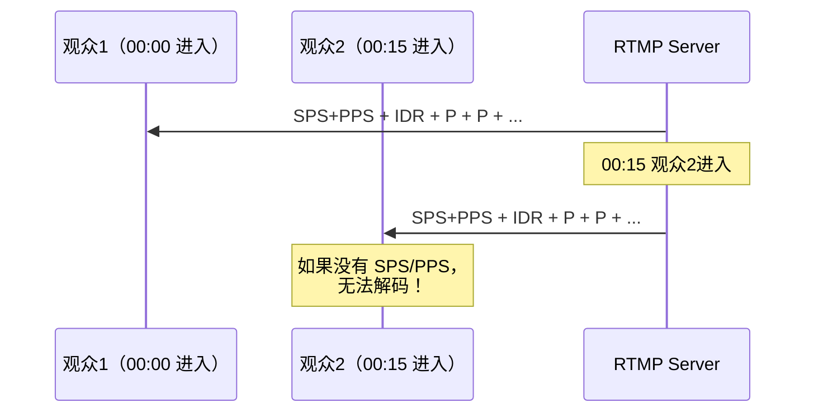

# H.264 SPS & PPS 理解

## 目录

- [Q1：IDR 帧和普通 I 帧的区别？](#q1idr-帧和普通-i-帧的区别)
- [Q2：SPS 和 PPS 位于什么位置？每个 GOP 都有一对吗？](#q2sps-和-pps-位于什么位置每个-gop-都有一对吗)
- [Q3：SPS/PPS 是全局参数还是 GOP 独有的？](#q3spspps-是全局参数还是-gop-独有的)
- [Q4：SPS 详解（NAL Unit Type = 7）](#q4sps-详解nal-unit-type--7)
- [Q5：PPS 详解（NAL Unit Type = 8）](#q5pps-详解nal-unit-type--8)
- [Q6：SPS 和 PPS 在码流中如何存放？](#q6sps-和-pps-在码流中如何存放)
- [Q7：为什么流媒体中每个 IDR 前都要带 SPS/PPS？](#q7为什么流媒体中每个-idr-前都要带-spspps)
- [关键源码索引](#关键源码索引)

---

## Q1：IDR 帧和普通 I 帧的区别？

### 问题递进

看到"IDR帧"和"I帧"两个概念 → 疑惑：不都是帧内编码帧吗？为什么要有两种？→ 追查 H.264 规范中的定义和实际编码器行为。

### 核心区别

| 特性 | 普通 I 帧（I Slice） | IDR 帧（Instantaneous Decoder Refresh） |
|------|---------------------|----------------------------------------|
| **编码方式** | 帧内预测，不参考其他帧 | 帧内预测，不参考其他帧 |
| **解码参考** | 后面的帧**可以**跨过它参考更早的帧 | 后面的帧**绝对不能**参考 IDR 之前的帧 |
| **DPB 清空** | 不清空解码图像缓冲区（DPB） | **强制清空 DPB** |
| **随机访问点** | 不是可靠的随机访问点 | 是**唯一的可靠随机访问点** |
| **错误恢复** | 无法阻断错误传播 | **彻底阻断**错误传播链条 |
| **编码效率** | 相对较高（GOP 内部 I 帧） | 相对较低（需完全刷新） |
| **NAL Unit Type** | `1`（非 IDR slice） | `5`（IDR slice） |

### 关键理解

> **IDR 帧是 I 帧的子集。所有 IDR 帧都是 I 帧，但不是所有 I 帧都是 IDR 帧。**

核心差异在于"参考屏障"：

```
普通 I 帧场景（Open GOP）：
P1 ← P2 ← I3 ← B4 ← P5 ← B6
         ↑___________↑
    B4 可以引用 P2（跨过 I3！）

IDR 帧场景（Closed GOP）：
P1 ← P2 ← IDR3 ← B4 ← P5 ← B6
          ║
    ═══════╝ 绝对屏障
    B4 不能引用 P1/P2
```

### NAL Unit Header 区分

```
nal_unit_type = 5  → IDR 帧（Coded slice of an IDR picture）
nal_unit_type = 1  → 非 IDR 的 I/P/B 帧的 slice
```

NAL Unit Header 中还有 `idr_pic_flag` 字段，解码器根据它决定是否清空 DPB。

---

## Q2：SPS 和 PPS 位于什么位置？每个 GOP 都有一对吗？

### 问题递进

看到码流中有 SPS/PPS → 疑惑：它们到底放在哪里？每个 GOP 开头都有吗？→ 追查 H.264 码流结构和实际封装方式。

### SPS/PPS 定义

| 参数集 | 全称 | NAL Unit Type | 包含内容 |
|--------|------|:---:|---------|
| **SPS** | Sequence Parameter Set | `7` | 图像尺寸、profile/level、帧数、DPB 大小等**序列级**参数 |
| **PPS** | Picture Parameter Set | `8` | 熵编码模式、slice 分组、量化参数等**图像级**参数 |

### 在码流中的位置

**原始 H.264 裸流（Annex B 格式）中：**

```
[SPS] [PPS] [IDR] [P] [P] ... [IDR] [P] [P] ... [IDR] [P] ...
  ↑
SPS/PPS 通常只在码流开头出现一次
```

**在 FLV/RTMP 封装中：**

```
AVC sequence header（onMetaData 之前或首帧之前）：
  包含 SPS + PPS，以 AVCDecoderConfigurationRecord 格式存放

每个 GOP 开头（每个 IDR 帧之前）：
  RTMP 通常会再次发送 AVC sequence header
```

**在 MP4/TS 封装中：**

```
moov box / PAT/PMT 之后：包含 SPS/PPS
关键帧 Sample 中：SPS/PPS 作为 sample description 的一部分
```

### 每个 GOP 都有 SPS/PPS 吗？

> **不一定，取决于封装格式和传输场景，但强烈建议每个 IDR 前都附带 SPS/PPS。**

| 场景 | 是否每个 GOP 都有 | 原因 |
|------|:---:|------|
| **本地文件播放** | 通常只有一份 | 播放器启动时读取一次即可，不需要重复 |
| **RTMP 直播推流** | **必须有** | 观众随时进入直播间，必须能立刻解码 |
| **HLS 切片** | 每个 TS 分片都要 | 分片独立可播放 |
| **RTP 传输** | 定期重传 | 防止丢包导致无法解码 |
| **监控录像** | 建议有 | 任意时间点回放需要能快速初始化 |

---

## Q3：SPS/PPS 是全局参数还是 GOP 独有的？

### 问题递进

理解了 SPS/PPS 是全局参数 → 疑惑：那为什么流媒体中每个 GOP 都要带？不矛盾吗？→ 追查原因。

### 核心结论

> **SPS 和 PPS 是整个视频序列的全局参数，而不是某个 GOP 独有的。流媒体中重复发送的是同一份数据，不是 GOP 各自拥有独立副本。**

### 层级关系



**SPS 在最顶层**，PPS 引用 SPS，每个 GOP 中的 Slice 引用 PPS。这就是 H.264 精心设计的**参数集分层架构**。

### 流媒体重复发送的原因

| 原因 | 说明 |
|------|------|
| **随机接入** | 新观众不知道之前的 SPS/PPS，必须重新发送 |
| **容错性** | 网络丢包可能丢失之前的 SPS/PPS，重发保证鲁棒性 |
| **解码器初始化** | 解码器需要 SPS/PPS 才能初始化，不能凭空解码 |

> 就像广播电台每隔一段时间重复报台名——不是台名变了，是给新听众听的。

### FLV 文件中 SPS/PPS 数据的一致性

AVC sequence header 中的 SPS/PPS 与后续每个 IDR 关键帧中带的 SPS/PPS 是**逐字节相同**的：

```
AVC sequence header:  SPS = [67 4D 40 1F ...]  PPS = [68 EB 8F 2C ...]
第1个 IDR 前的 SPS:     [67 4D 40 1F ...]  ← 完全相同
第2个 IDR 前的 SPS:     [67 4D 40 1F ...]  ← 完全相同
第50个 IDR 前的 SPS:    [67 4D 40 1F ...]  ← 还是它
```

---

## Q4：SPS 详解（NAL Unit Type = 7）

### 问题递进

知道 SPS 是序列参数集 → 疑惑：里面到底有哪些关键字段？每个字段什么含义？→ 参考 H.264 规范 + 博客。

### 背景

H.264 编码标准将功能分为两层：

- **VCL（视频编码层）**：负责视频内容的处理，重点在于编解码算法。
- **NAL（网络抽象层）**：负责将编码后的数据以网络要求的格式进行打包和传输。

SPS 属于 NAL 层，保存一组**编码视频序列**的全局参数。一个编码视频序列以 IDR 帧开始，SPS 中的参数在整个序列中保持不变，直到下一个新的 SPS 出现。

### 关键语法元素

| 参数名称 | 含义说明 |
|:---|:---|
| **profile_idc** | 标识码流所遵从的**档次 (Profile)**：<br/>`66` → Baseline Profile<br/>`77` → Main Profile<br/>`88` → Extended Profile |
| **level_idc** | 标识码流所遵从的**级别 (Level)**，定义了最大视频分辨率、帧率等参数 |
| **seq_parameter_set_id** | 序列参数集的 ID，供 PPS 引用（取值 0~31） |
| **log2_max_frame_num_minus4** | 用于计算 `MaxFrameNum`，它是 `frame_num` 的上限值 |
| **pic_order_cnt_type** | 表示解码**图像顺序计数 (POC)** 的方法，用于确定图像的显示顺序（取值 0/1/2） |
| **pic_width_in_mbs_minus1** | 用于计算图像宽度，公式：`宽度(像素) = 16 × (该值 + 1)` |
| **pic_height_in_map_units_minus1** | 结合 `frame_mbs_only_flag` 一起计算图像高度 |
| **frame_mbs_only_flag** | `1` = 所有宏块均采用帧编码；`0` = 宏块可能为帧编码或场编码 |
| **frame_cropping_flag** | `1` = 需要对输出图像帧进行裁剪 |
| **frame_crop_left_offset** / **frame_crop_right_offset** | 裁剪偏移量（左右） |
| **frame_crop_top_offset** / **frame_crop_bottom_offset** | 裁剪偏移量（上下） |
| **vui_parameters_present_flag** | `1` = SPS 中包含视频可用性信息 (VUI) 参数 |

### 实际分辨率计算

```c
// 宽度
width = (pic_width_in_mbs_minus1 + 1) * 16;

// 高度
if (frame_mbs_only_flag) {
    height = (pic_height_in_map_units_minus1 + 1) * 16;
} else {
    height = (pic_height_in_map_units_minus1 + 1) * 32;  // 场编码
}

// 如果开启裁剪
if (frame_cropping_flag) {
    width  -= (frame_crop_left_offset + frame_crop_right_offset) * 2;
    height -= (frame_crop_top_offset + frame_crop_bottom_offset) * 2;
}
```

---

## Q5：PPS 详解（NAL Unit Type = 8）

### 问题递进

理解了 SPS 是全局参数 → 疑惑：PPS 和 SPS 的关系是什么？PPS 里有啥？→ 追查 PPS 结构。

### 定义

PPS 保存**一帧编码图像**所依赖的参数。在一个编码视频序列中，可以有多帧图像，它们可能引用不同的 PPS。PPS 通过 `seq_parameter_set_id` 引用一个激活的 SPS。

### 关键语法元素

| 参数名称 | 含义说明 |
|:---|:---|
| **pic_parameter_set_id** | 当前 PPS 的 ID，供 Slice 引用（取值 0~255） |
| **seq_parameter_set_id** | 引用一个激活的 SPS 的 ID，从而获取该 SPS 中的全局参数 |
| **entropy_coding_mode_flag** | 熵编码模式标识：<br/>`0` → CAVLC<br/>`1` → CABAC |
| **num_slice_groups_minus1** | 一帧中条带组 (slice group) 的个数，`0` 表示整帧为 1 个 slice |
| **weighted_pred_flag** | `1` = 在 P/SP 条带中开启**加权预测** |
| **pic_init_qp_minus26** | 初始量化参数偏移，实际 QP = `26 + pic_init_qp_minus26 + slice_qp_delta` |
| **deblocking_filter_control_present_flag** | `1` = Slice Header 中存在**去块滤波器**相关控制信息 |
| **constrained_intra_pred_flag** | `1` = I 宏块帧内预测只能使用来自 I 和 SI 类型宏块的信息 |

### SPS ↔ PPS ↔ Slice 引用关系

```
Slice Header
  │
  └── pic_parameter_set_id ──→ PPS
                                  │
                                  ├── pic_parameter_set_id (自身 ID)
                                  ├── seq_parameter_set_id ──→ SPS
                                  ├── entropy_coding_mode_flag
                                  ├── pic_init_qp_minus26
                                  └── ...
                                         │
                                         └── SPS
                                               ├── seq_parameter_set_id (自身 ID)
                                               ├── profile_idc / level_idc
                                               ├── pic_width_in_mbs_minus1
                                               └── ...
```

---

## Q6：SPS 和 PPS 在码流中如何存放？

### Annex B 格式（裸流）

使用起始码 `0x00 0x00 0x00 0x01` 或 `0x00 0x00 0x01` 分隔每个 NAL Unit：

```
00 00 00 01 | 67 ...       ← SPS (NAL type = 7, 首字节 0x67 = 0110 0111)
00 00 00 01 | 68 ...       ← PPS (NAL type = 8, 首字节 0x68 = 0110 1000)
00 00 00 01 | 65 ...       ← IDR (NAL type = 5, 首字节 0x65 = 0110 0101)
00 00 00 01 | 41 ...       ← Non-IDR Slice (NAL type = 1, 首字节 0x41 = 0100 0001)
```

### NAL Unit 首字节结构

```
┌─┬─┬─┬─┬─┬─┬─┬─┐
│0│ │ │ │ │ │ │ │  ← forbidden_zero_bit（固定为 0）
│ │1│1│ │ │ │ │ │  ← nal_ref_idc（SPS/PPS/IDR 为 11，非参考帧为 00）
│ │ │ │0│1│1│1│1│  ← nal_unit_type = 7（SPS）
└─┴─┴─┴─┴─┴─┴─┴─┘
```

| NAL Unit Type | 首字节（含 nal_ref_idc=3） | 含义 |
|:---:|:---:|------|
| `5` | `0x65` | IDR 帧的 Slice |
| `6` | `0x06` | SEI（辅助增强信息） |
| `7` | `0x67` | SPS |
| `8` | `0x68` | PPS |
| `1` | `0x41` | 非 IDR 帧的 Slice（P/B 帧） |

### 在 FLV/RTMP 中的存放

```
FLV Header
  ├── onMetaData Tag
  ├── Video Tag (AVC sequence header, frame type=0)
  │     └── AVCDecoderConfigurationRecord
  │           ├── configurationVersion (=1)
  │           ├── AVCProfileIndication (对应 profile_idc)
  │           ├── profile_compatibility
  │           ├── AVCLevelIndication (对应 level_idc)
  │           ├── lengthSizeMinusOne (NAL 长度字段字节数，通常为 3)
  │           ├── numOfSequenceParameterSets
  │           │     ├── SPS Length (2 bytes)
  │           │     └── SPS NAL Unit Data
  │           └── numOfPictureParameterSets
  │                 ├── PPS Length (2 bytes)
  │                 └── PPS NAL Unit Data
  ├── Video Tag (keyframe / IDR)
  │     └── [SPS] [PPS] [IDR Slice NALs] (一起打包)
  └── ...
```

---

## Q7：为什么流媒体中每个 IDR 前都要带 SPS/PPS？

### 问题递进

SPS/PPS 是全局参数，内容不变 → 疑惑：为什么 RTMP 推流每个 IDR 前都重发？→ 追查。

### 原因



观众可能在任何时刻进入直播间，服务端收到新订阅请求后，必须等到下一个 IDR + SPS/PPS 组合才能发送关键帧序列，否则新观众无法初始化解码器。

### 三个核心原因

| 原因 | 说明 |
|------|------|
| **随机接入** | 新观众不知道之前的 SPS/PPS，必须重新发送 |
| **容错性** | 网络丢包可能丢失之前的 SPS/PPS，重发保证鲁棒性 |
| **解码器初始化** | 解码器需要 SPS/PPS 才能初始化，不能凭空解码 |

> **重复发送的是同一份 SPS/PPS，内容完全一样。就像广播电台每隔一段时间重复报台名，不是台名变了，是给新听众听的。**

---

## 关键源码索引

| 文件 | 说明 |
|------|------|
| `rtmp/` 目录下相关文件 | RTMP 推拉流中 SPS/PPS 的解析和发送逻辑 |
| `hook.cpp` | 网络 I/O hook，涉及流媒体传输底层 |

---

> **参考博客**：[H264码流中SPS PPS SEI概念及详解 - CSDN](https://blog.csdn.net/huabiaochen/article/details/120321905)
